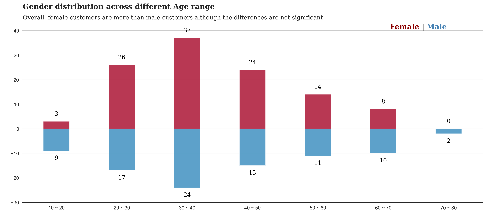

# Mall Customer Segmentation with Clustering Analysis
The project focuses on segmenting customers with unsupervised machine learning using K-means clustering.

## 1. Project Objectives

Through clustering analysis utilizing unsupervised machine learning techniques, specifically k-means clustering, we uncover distinct segments characterized by specific behaviors and attributes. This enables the formulation of targeted marketing strategies tailored to each segment's unique needs.

## 2. Analysis Techniques 
In the analysis process, I followed three critical steps to ensure robust and accurate clustering results:

1. _**Explorative Data Analysis (EDA)**_: visualizing data distributions, identifying outliers, and **uncovering initial patterns** to thoroughly understand and familiarize myself with the dataset. EDA provided **valuable insights** that later aided in verifying the performance of the k-means clustering results and **establishing criteria for effective segmentation**.
   
2. _**K-means Clustering Optimization**_: beginning with the **optimization of hyperparameters** to achieve the best clustering results. To address the unsupervised nature of this learning method, I **used indirect metrics** to confirm the results. First I utilized **a Screeplot** (also known as an Elbow plot) to determine the o**ptimal number of clusters**. Additionally, I **visualized the Silhouette Score **using a heatmap to assess the density and separation distance between neighboring clusters. Finally, I **examined the Silhouette Score's thickness and size** to ensure consistency and confirm that there were **no wide fluctuations**, thereby validating the stability of the clusters."

   
3. _**Segmentation Results and Actionable Insights**_: I employed the optimized hyperparameters to perform the clustering. Subsequently, I **visualized the 6 clusters** using a **3D plot**, which allowed for a clear representation of the distinct clusters. I assigned **meaningful names to each group**, drawing from the criteria established during the EDA step. To effectively **communicate my findings**, I used **box plots and bar plots**, presenting the results in a visual and actionable manner that highlighted key insights differences and **recommendations among top-4 potential clusters**.
 
 ###  ✨ 2.3 Segmentation Results and Actionable Insights

    

###  ✨ 2.1 Explorative Data Analysis (EDA)

    

### ✨ 2.2 K-means Clustering Optimization

    
