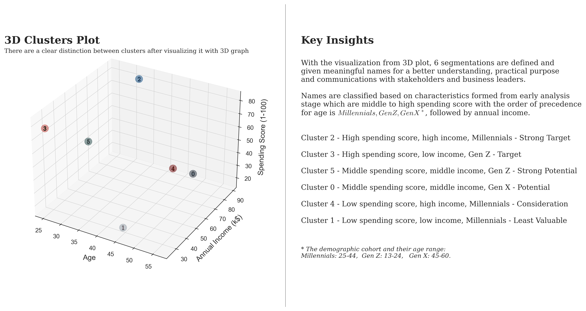

# Mall Customers Segmentation with Clustering Analysis
The project focuses on segmenting customers using unsupervised machine learning K-means clustering.

## 1. Project Objectives

Through clustering analysis utilizing unsupervised machine learning techniques, specifically k-means clustering, we uncovered 6 distinct segments characterized by specific behaviors and attributes. This enables the formulation of targeted marketing strategies tailored to each segment's unique needs.
## 2. Analysis Techniques 
In the analysis process, I followed three critical steps to ensure robust and accurate clustering results:
1. _**Explorative Data Analysis (EDA)**_:To extract, transform, and prepare data for analysis.
   
2. _**K-means Clustering Optimization**_: **optimization of hyperparameters** to achieve the best clustering results with **Scree plot** (also known as an Elbow plot). Then I calculate **Silhouette scores** and visualized it to validate the **stability of the clusters**.
   
3. _**Segmentation Results and Actionable Insights**_: **visualized the 6 clusters** using a **3D plot**, assigned **meaningful names to each group** and highlight key insights and **recommendations for the top 4 customer segments**.
##  ✨ 3.1 Explorative Data Analysis (EDA)
Visualizing data distributions, identifying outliers, and **uncovering initial patterns**  that later aided in verifying the performance of the k-means clustering results and **establishing criteria for effective segmentation**.

### 3.1.1 Data distributions, understand and familiarize with the dataset
  

    
### 3.1.2 The potential relationships within our dataset that we expect to observe after applying the k-means clustering model

 

##  ✨ 3.3 Segmentation Results and Actionable Insights
Employed the optimized hyperparameters to perform the clustering. Subsequently, I **visualized the 6 clusters** using a **3D plot**, assigned **meaningful names to each group**. To effectively **communicate my findings**, I used **box plots and bar plots** to highlight key insights and **recommendations among the top 4 customer segments**.

### 3.3.1 Assigned Meaningful Names To Each Segment

### 3.3.2 Recommendations Among Top-4 Potential Customer Segments
 
    

## ✨ 3.2 K-means Clustering Optimization
**Optimization of hyperparameters** to achieve the best clustering results. To address the unsupervised nature of this learning method, I **used indirect metrics** to confirm the results:

   -  Utilized **Scree plot** (also known as an Elbow plot) to determine the **optimal number of clusters**.
   -  Calculate **Silhouette scores** and visualized it with heatmap to choose the **random state number.**
   -  **Plot Silhouette Score** to ensure consistency and confirm that there were **no wide fluctuations**, thereby validating the **stability of the clusters**."

### 3.2.1 Find optimal number of clusters with scree plot

### 3.2.2 Generate heatmap to visualize Silhouette Score against different the number of clusters and random states

So far, we confirmed that n_clusters=6 is the optimal value, but the random_state numbers have many numbers with the same Silhouette score. Therefore, we calculate Silhouette scores with different number of clusters and random state numbers then visualize it to choose paramaters that have Silhouette as close to 1 as possible since it is measured within range of (-1, 1). 

(The definition of Silhouette is explained in the plot)

    
### 3.2.3  Ensure the consistency and confirm that there were no wide fluctuation with the chosen hyperparameters

We will validate our choice by plotting Silhouette score against kmeans.labels_. The plot will be examined under these conditions:

- The presence of clusters are more or less of similar thickness and the size of the silhouette plots aren't in wide fluctuations.
- The average silhouette score is visualized by a red vertical line to confirm that Cluster scores should be higher than the average silhouette score.

#### ✨ We achieved the conditions with n_clusters=6 and random_state=10, n_init=30

#### For comparison purposes, we also generated the visualization with n_clusters set to 5 and 7.

    
